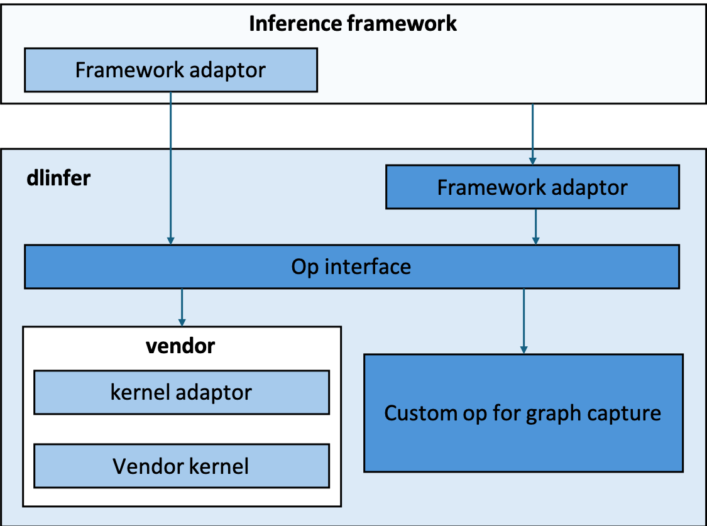

# 介绍

dlinfer提供了一套将国产硬件接入大模型推理框架的解决方案。
对上承接大模型推理框架，对下在eager模式下调用各厂商的融合算子，在graph模式下调用厂商的图引擎。
在dlinfer中，我们根据主流大模型推理框架与主流硬件厂商的融合算子粒度，定义了大模型推理的融合算子接口。

这套融合算子接口主要功能：

1. 将对接框架与对接厂商融合算子在适配工程中有效解耦；
2. 同时支持算子模式和图模式；
3. 图模式下的图获取更加精确匹配，提高最终端到端性能；
4. 同时支持LLM推理和VLM推理。

目前，我们正在全力支持LMDeploy适配国产芯片，包括华为，沐曦，寒武纪等。

# 架构介绍

<!-- markdownlint-disable -->
<div align=center>

</div>
<!-- markdownlint-restore -->

## 组件介绍

- **op interface**：
大模型推理算子接口，对齐了主流推理框架以及各个厂商的融合算子粒度。
  - 算子模式：在pytorch的eager模式下，我们将通过op interface向下分发到厂商kernel。由于各个厂商对于参数的数据排布有不同的偏好，所以在这里我们并不会规定数据排布，但是为了多硬件的统一适配，我们将会统一参数的维度信息。
  - 图模式：在极致性能的驱动下，在一些硬件上的推理场景中需要依靠图模式。我们利用Pytorch2中的Dynamo编译路线，通过统一的大模型推理算子接口，获取较为粗粒度算子的计算图，并将计算图通过IR转换后提供给硬件厂商的图编译器。
- **framework adaptor**：
将大模型推理算子接口加入推理框架中，并且对齐算子接口的参数。
- **kernel adaptor**：
吸收了大模型推理算子接口参数和硬件厂商融合算子参数间的差异。

# 安装方法

## pip安装

```shell
pip install dlinfer-ascend
```

目前只有华为支持pip安装。沐曦请使用源码安装。

## 源码安装

### 华为Atlas 800T A2

1. 在Atlas 800T A2上依赖torch和torch_npu，运行以下命令安装torch、torch_npu及其依赖。

   ```shell
   pip3 install -r requirements/ascend/full.txt
   ```

2. 完成上述准备工作后，使用如下命令即可安装dlinfer。

   ```shell
   cd /path_to_dlinfer
   DEVICE=ascend python3 setup.py develop
   ```

### 沐曦C500

1. 沐曦软件栈请自行联系沐曦相关人员。

2. 沐曦版本的dlinfer安装命令如下：

   ```shell
   cd /path_to_dlinfer
   DEVICE=maca python3 setup.py develop
   ```

# 支持模型框架列表

## LMDeploy

|  | |华为Atlas 800T A2 | |沐曦C500 | 寒武纪云端智能加速卡（开发中） |
| --- | --- | --- | --- | --- | --- |
|  | bf16(eager) | w4a16(eager) | bf16(graph) |   |   |
| InternLM2.5-7B/20B   | √ | √ | √ | √  |  |
| InternLM2-7B/20B     | √ | √ | √ | √  |  |
| InternVL2-2B         | √ | √ | √ | √  |  |
| InternVL1-5          | √ | √ | - | √  |  |
| Llama3(.1)-8B        | √ | √ | √ | √  |  |
| Mixtral8x7B          | √ | X | √ | √  |  |
| Qwen2(.5)-7B         | √ | X | √ | √  |  |
| Qwen2-57B-A14B       | √ | X | - | √  |  |
| CogVLM               | √ | X | - | √  |  |
| CogVLM2              | √ | X | - | √  |  |
| glm-4v-9b            | √ | - | - | -  |  |

‘√’代表测试通过，‘X’代表不支持，‘-’代表未测试

### 使用LMDeploy

只需要指定pytorch engine后端为ascend/maca，不需要其他任何修改即可。详细可参考lmdeploy文档。

> [!CAUTION]
> 沐曦环境下必须把`PytorchEnginConfig`中的`block_size`设为`256`。

示例代码如下：

```python
import lmdeploy
from lmdeploy import PytorchEngineConfig
if __name__ == "__main__":
    pipe = lmdeploy.pipeline("/path_to_model",
                            backend_config = PytorchEngineConfig(tp=1,
                            cache_max_entry_count=0.4, device_type="ascend", eager_mode=True))
    question = ["Shanghai is", "Please introduce China", "How are you?"]
    response = pipe(question, request_output_len=256, do_preprocess=False)
    for idx, r in enumerate(response):
        print(f"Q: {question[idx]}")
        print(f"A: {r.text}")
        print()
```

> [!TIP]
> 图模式已经支持了Atlas 800T A2。
> 用户可以在离线模式下设定`PytorchEngineConfig`中的`eager_mode=False`来开启图模式，或者设定`eager_mode=True`来关闭图模式。
> 在线模式下默认开启图模式，请添加`--eager-mode`来关闭图模式。
> (启动图模式需要事先`source /usr/local/Ascend/nnal/atb/set_env.sh`)  
